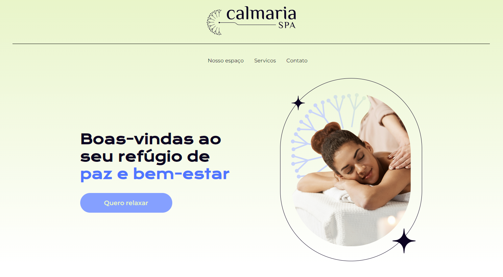

# Sass Pre-Processor Page

Este projeto é uma página web estática que aplica o uso de um pré-processador Sass para estilização CSS. 

## Funcionalidades

- Compilação automática de arquivos Sass para CSS
- Estrutura de diretórios organizada
- Estilização modular e reutilizável

## Tecnologias Utilizadas

- HTML5
- Sass (SCSS)
- CSS3
- JavaScript

## Como Usar

1. *Clone o repositório:*
   ```bash
   git clone https://github.com/Chikrem/sass_pre-processor_page.git
   cd sass_pre-processor_page

## Teste

O projeto pode ser visualizado em:

- [Vercel](https://sass-pre-processor-page-hut3apega-chikrems-projects.vercel.app/)

## Screenshots



